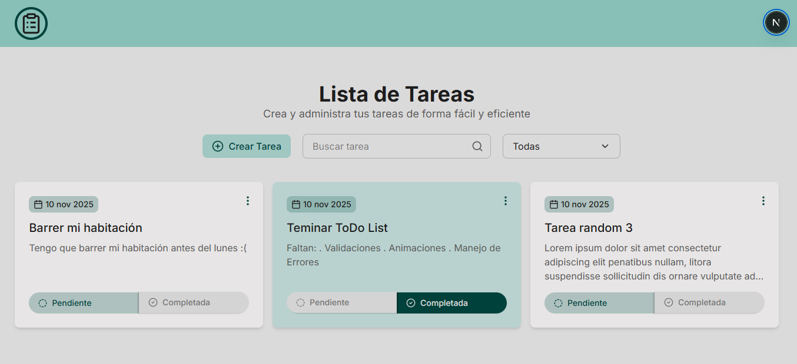
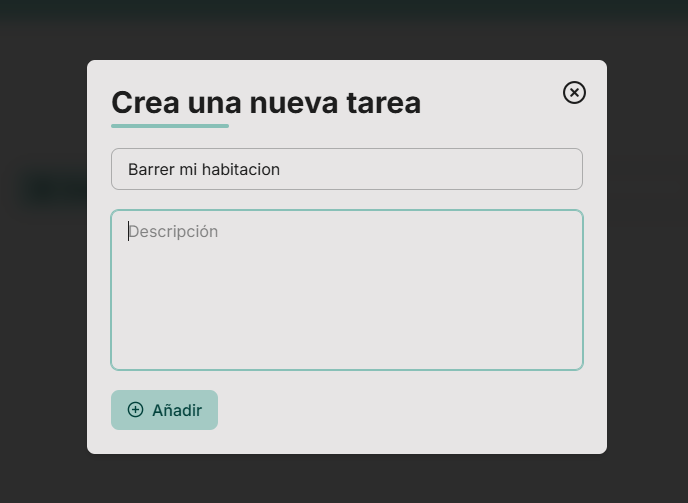
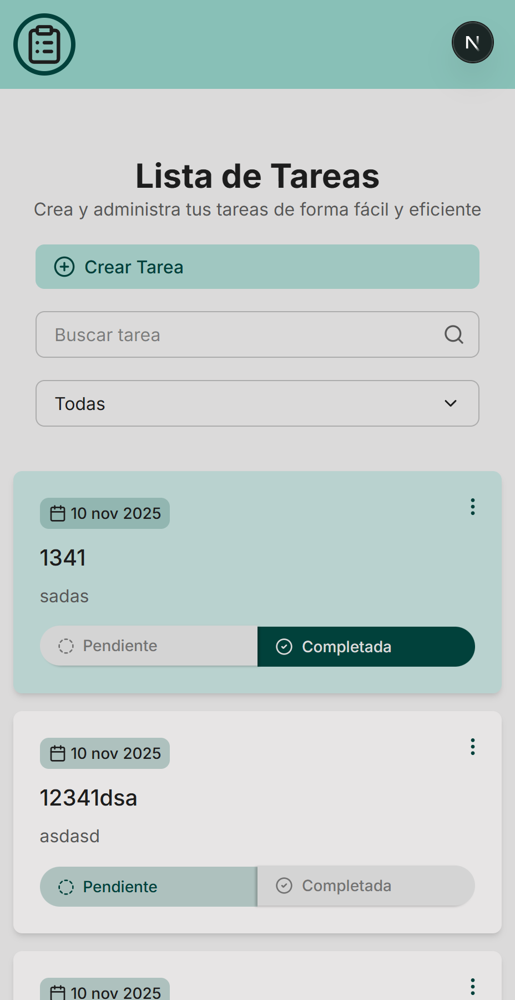

# To-Do List App (Reto para ForIT)

Una aplicación moderna de gestión de tareas construida con **Next.js** en el frontend y **Express** con **Better-SQLite3** en el backend.  
Incluye animaciones fluidas, validaciones robustas, filtros y una experiencia totalmente responsive.

---

## Tecnologías principales

### **Frontend**

- [Next.js](https://nextjs.org/) — Framework React para renderizado híbrido y rutas dinámicas.
- [Tailwind CSS](https://tailwindcss.com/) — Estilos rápidos y consistentes con clases utilitarias.
- [Motion](https://www.framer.com/motion/) — Animaciones fluidas y transiciones con `AnimatePresence`.
- [React Hook Form](https://react-hook-form.com/) — Manejo de formularios eficiente.
- Variables globales — Sistema de colores y clases de utilidad personalizadas para mantener coherencia visual.

### **Backend**

- [Express.js](https://expressjs.com/) — API REST sencilla y robusta.
- [Better-SQLite3](https://github.com/WiseLibs/better-sqlite3) — Base de datos liviana, sin dependencias nativas.
- Endpoints CRUD completos para crear, leer, actualizar y eliminar tareas.

### **Compartidos**

- [Zod](https://zod.dev/) — Validación de datos con esquemas y tipos de datos.

---

## Características

- **Creación, edición y eliminación** de tareas.
- **Barra de búsqueda** para filtrar tareas por título o descripción.
- **Filtro dinámico** (todas / pendientes / completadas).
- **Animaciones suaves** con `motion` al agregar, eliminar o editar tareas.
- **Diseño totalmente responsive**, adaptado para escritorio, tablet y móvil.
- **Temas consistentes** con variables globales de color y clases utilitarias.
- **Validaciones robustas** en formularios usando Zod + React Hook Form.
- **Arquitectura modular** con hooks personalizados y componentes reutilizables.

---

## Instalación y ejecución

### 1. Clonar el repositorio

```bash
git clone https://github.com/Nicron7/todo-list-forit
cd todo-list
```

### 2. Instalar dependecias

#### Frontend

```bash
cd frontend
pnpm i
```

#### Backend

```bash
cd backend
npm install
```

### 3. Ejecutar la aplicación

#### Frontend

```bash
pnpm dev
```

La app estará disponible en http://localhost:3000

#### Backend

```bash
npm run dev
```

El servidor correrá en http://localhost:3010

## Endpoints principales (API)

| Método     | Ruta                        | Descripción                             |
| ---------- | --------------------------- | --------------------------------------- |
| **GET**    | `/tasks`                    | Obtiene todas las tareas                |
| **GET**    | `/tasks/search?query=texto` | Busca tareas por texto (solo el título) |
| **POST**   | `/tasks`                    | Crea una nueva tarea                    |
| **PUT**    | `/tasks/:id`                | Actualiza título o descripción          |
| **PUT**    | `/tasks/:id/complete`       | Cambia estado completado/pending        |
| **DELETE** | `/tasks/:id`                | Elimina una tarea                       |

## Lógica principal del frontend

- **`useTasks.ts`** encapsula toda la lógica de fetch, CRUD y estado global de tareas.
- **`CustomSelect`** implementa un select animado con Motion.
- **`SearchBar`** gestiona la búsqueda con teclado o botón.
- **`CreateTaskModal`** permite crear nuevas tareas con validación de Zod + RHF.
- **`TaskCard`** muestra cada tarea con acciones rápidas (editar, eliminar, ver).

## Capturas de pantalla

### Página principal



### Crear tarea



### Vista móvil



## Gracias por tu visita! Espero te haya gustado.
